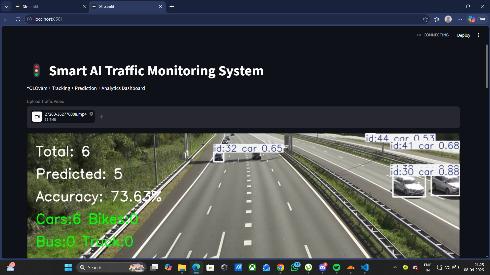
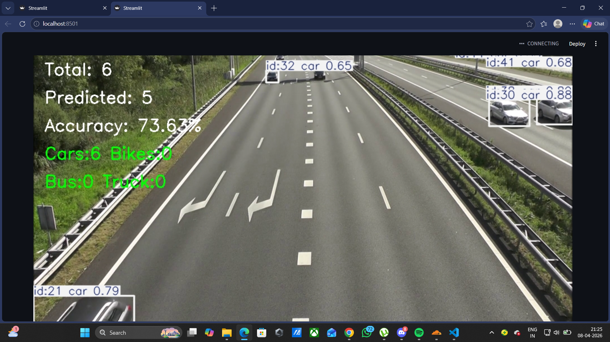
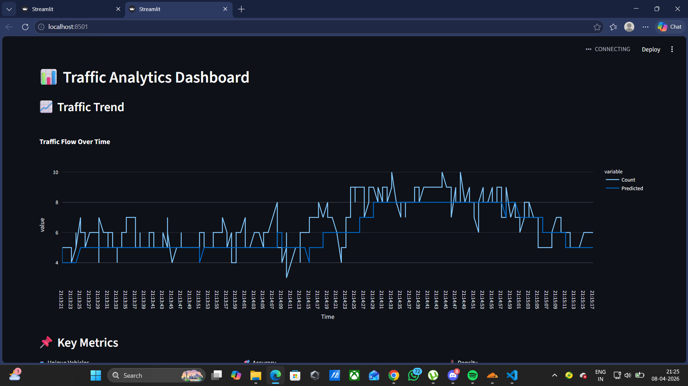
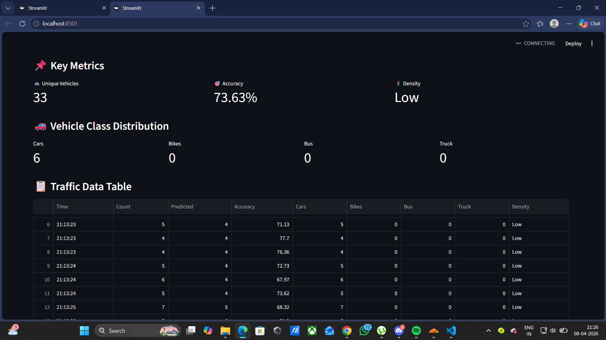
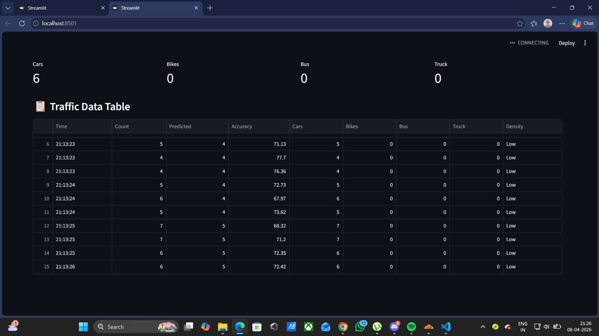
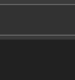

# 🚦 Smart AI Traffic Monitoring System

A real-time **AI-powered traffic monitoring and analytics dashboard** built using **YOLOv8, OpenCV, Streamlit, Plotly, and SQLite**.

This project performs **vehicle detection, tracking, traffic density estimation, prediction, and dashboard visualization** from uploaded traffic videos.

---

## 🔥 Features

- 🚗 **Real-time Vehicle Detection**
  - Detects **cars, bikes, buses, and trucks**
  - Uses **YOLOv8m** for better accuracy

- 🎯 **Detection Accuracy**
  - Displays average confidence score as detection accuracy %

- 📈 **Traffic Prediction**
  - Predicts upcoming traffic count using moving average

- 🚦 **Traffic Density Analysis**
  - Classifies traffic as:
    - Low
    - Medium
    - High

- 📊 **Interactive Dashboard**
  - Traffic trend graph
  - Vehicle class distribution
  - Unique vehicle count
  - Accuracy metrics

- 💾 **Data Storage**
  - Stores traffic analytics using **SQLite**
  - Generates structured table output

---

## 🛠 Tech Stack

- **Python**
- **YOLOv8 (Ultralytics)**
- **OpenCV**
- **Streamlit**
- **Plotly**
- **Pandas / NumPy**
- **SQLite**

---

## 📂 Project Structure

```text
Traffic/
│── app.py
│── README.md
│── requirements.txt
│── traffic.db
│── traffic_data.csv
```

---

## 🚀 Installation & Run

### 1. Clone Repository

```bash
git clone https://github.com/YOUR_USERNAME/smart-ai-traffic-monitoring-system.git
cd smart-ai-traffic-monitoring-system
```

---

### 2. Install Dependencies

```bash
pip install -r requirements.txt
```

---

### 3. Run Project

```bash
streamlit run app.py
```

---

## 📸 Output Dashboard

<table style="width: 100%; border-collapse: collapse;">
<tr>
<td align="center"><b>Live Vehicle Detection</b>


</td>
<td align="center"><b>Traffic Prediction</b>


</td>
</tr>
<tr>
<td align="center"><b>Detection Accuracy</b>


</td>
<td align="center"><b>Traffic Density Analysis</b>


</td>
</tr>
<tr>
<td align="center"><b>Traffic Trend Graph</b>


</td>
<td align="center"><b>Vehicle Class Distribution</b>


</td>
</tr>
</table>

Features included:
- live vehicle detection
- prediction
- accuracy
- density
- traffic graph
- class distribution

---

## 🏆 Resume Highlight

Developed a **real-time AI traffic monitoring dashboard** using **YOLOv8 + Streamlit**, featuring vehicle detection, tracking, traffic prediction, density analytics, and interactive visualization.

---

## 👨‍💻 Author

**Raj Karmankar**
